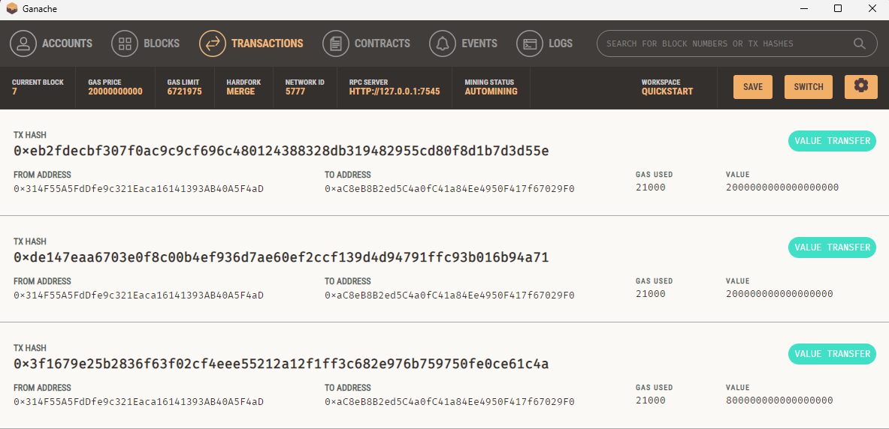
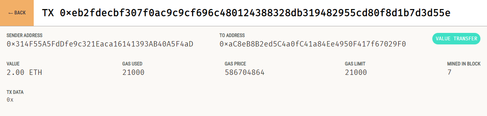

# Ethereum Transactions Demo

In this challenge, I demonstrate a command of using Ethereum to process transactions on a test network and facilitate the process via a streamlit application.

### Streamlit Page

Here, a user can select from 1 of 4 fintech professionals and contract them for their services using Ethereum.

### Ganache Transaction history

In the transaction history on the testing network, we see the history of the executed transactions committed during the testing phase.

Above is a more in-depth look at the transaction resulting from the inputs displayed in the above streamlit screenshot!
